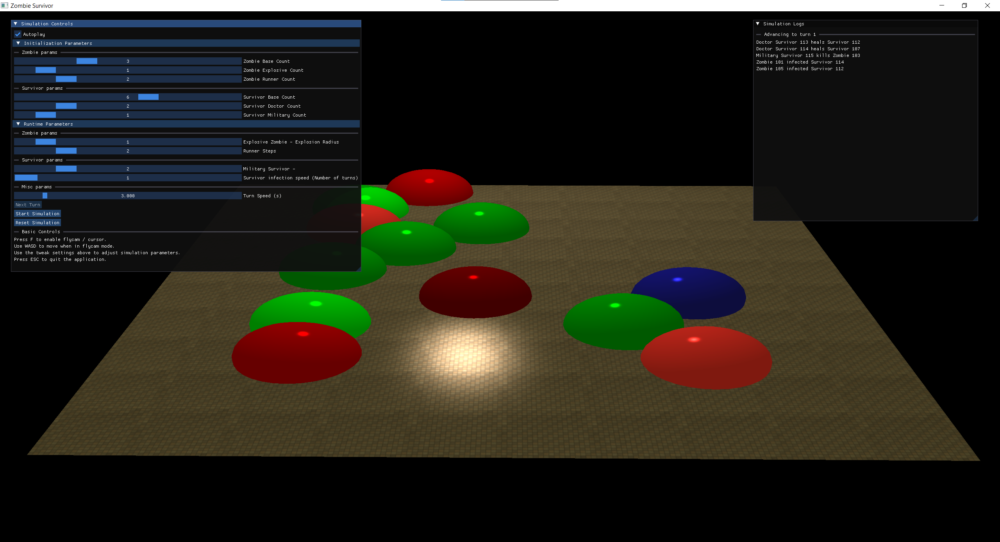
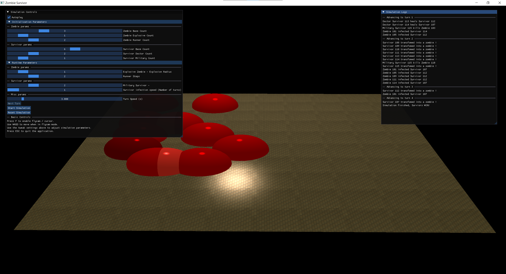

# Zombie Survivor

## Overview
Zombie Survivor is a simulation game built on a custom engine that uses an Entity-Component-System (ECS) architecture. Inspired by [Austin Morlan’s ECS article](https://austinmorlan.com/posts/entity_component_system/#the-entity), we expanded his implementation to be more flexible and robust by adding features such as component existence checking, error handling, and the ability to query lists of components. Our main focus is on the ECS pattern—following the principle of composition over inheritance—while using inheritance only outside of ECS when it makes sense. We also employ a simple event system for communication between modules and an update method pattern (from [Game Programming Patterns: Update Method](https://gameprogrammingpatterns.com/update-method.html)).

Overall, our design is reminiscent of Unity’s architecture, making it familiar and straightforward.

## Build Instructions
This project uses CMake (version ≤ 3.3) and vcpkg to manage external dependencies.

1. **Configure the Project:**
   - Ensure the `VCPKG_ROOT` environment variable is set to your local vcpkg installation path.
   - From the project root, run:
     ```
     cmake -S . -B build-debug -DCMAKE_TOOLCHAIN_FILE=%VCPKG_ROOT%/scripts/buildsystems/vcpkg.cmake
     ```
2. **Build the Project:**
   - Build the project using CMake. For example:
     ```
     cmake --build build-debug --config Release
     ```
   - For more details, refer to [Microsoft's vcpkg Getting Started guide](https://learn.microsoft.com/en-us/vcpkg/get_started/get-started?pivots=shell-bash#4---build-and-run-the-project).

## Architecture

**Entity-Component-System (ECS):**
- The engine is built using an ECS architecture. Entities are simple IDs; components are plain data containers; and systems process entities based on their component signatures.
- We follow the principle of *composition over inheritance*. Within the ECS, entities are composed of components rather than inheriting behavior. In other parts of the codebase (outside the ECS), inheritance is used sparingly when it is convenient. 

**Event System Pattern:**
- An event-driven approach is used for inter-system communication. Systems subscribe to events (e.g., new turn events, log messages) and react accordingly.
- Our current event dispatching is immediate, but we plan to transition to a queue-based event system in the future (see [Game Programming Patterns: Event Queue](https://gameprogrammingpatterns.com/event-queue.html)) to improve scalability and support multithreading.

**Update Pattern:**
- The update cycle follows the pattern described in [Game Programming Patterns: Update Method](https://gameprogrammingpatterns.com/update-method.html).

**Singleton Pattern:**
- A configuration singleton (Config) is used to manage simulation parameters, similar to Unity’s global settings.

## Dependencies
This project relies on several external libraries managed by vcpkg:
- **OpenGL** for rendering.
- **GLFW** for cross-platform window creation and input handling.
- **Dear ImGui** for the in-game UI.
- **GLM** for mathematical computations.
- **glad** as the OpenGL function loader.
- **assimp** for model loading.
- **stb_image** for image loading.

## Improvements & Future Work
**Decoupling Frontend and Engine Framework:**
- Currently, the engine and game frontend are integrated in one project. For long-term maintainability, the frontend should be decoupled into a separate project.
  
**Queue-Based Event System:**
- Future improvements include reworking the event system into a queue-based design to avoid repeated events and to support multithreading robustly.
  
**Enhanced System Functionality:**
- Further improvements may include using lambda registrations for system actions (e.g., for zombie and survivor behavior) and refining our ECS to support additional features.

## The Game
The simulation exposes various parameters via a Dear ImGui interface, allowing users to tweak the simulation at runtime.





### Entity Colors

In this simulation, each entity is rendered as a sphere. The color of the sphere indicates the type of entity:

**Survivors:**
- **Base Survivor:** Forest Green (`0.0, 0.7, 0.0`)
- **Doctor Survivor:** Lime Green (`0.0, 1.0, 0.0`)
- **Military Survivor:** Royal Blue (`0.1, 0.1, 0.8`)

**Zombies:**
- **Base Zombie:** Blood Red (`0.8, 0.0, 0.0`)
- **Explosive Zombie:** Dark Maroon (`0.5, 0.0, 0.0`)
- **Runner Zombie:** Bright Scarlet (`1.0, 0.2, 0.2`)


### Simulation Controls
- **Autoplay:** Toggle automatic turn progression.
- **Next Turn:** Manually advance the simulation by one turn.
- **Start Simulation / Reset Simulation:** Begin or reset the simulation.

### In-Game UI
**Log Window:**  
Displays real-time events such as:
- "Zombie X transforms Survivor Y"
- "Doctor Survivor X heals Survivor Y"
- "Military Survivor X kills Zombie Y"
Log entries are separated by turn markers.

**Instructions:**
- Press **F** to toggle between flycam and cursor mode.
- Use **W, A, S, D** to move when in flycam mode.
- Press **ESC** to quit the application.
- Adjust simulation parameters using the sliders and controls in the UI.

## Credits
This project architecture was heavily inspired by [Austin Morlan’s ECS article](https://austinmorlan.com/posts/entity_component_system). Many thanks to him for the inspiration. Additional patterns were drawn from [Game Programming Patterns](https://gameprogrammingpatterns.com/), and the overall design was influenced by Unity’s architecture.

Special thanks to Jean Ruiz for his invaluable advice, and for further inspiration see [Fluent C++: How to do partial template specialization in C++](https://www.fluentcpp.com/2017/08/11/how-to-do-partial-template-specialization-in-c/).
